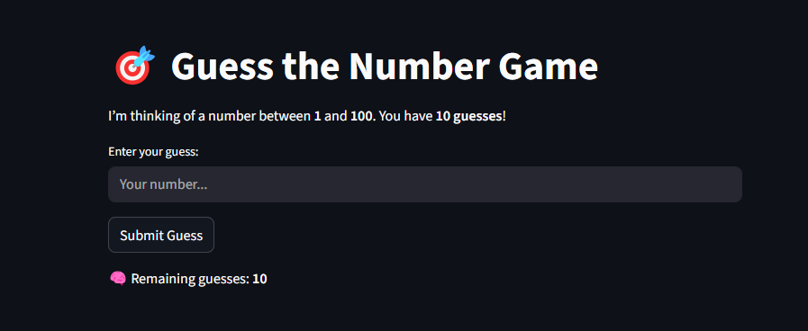

# 🎯 guesser.exe

> 🔢 A fun number-guessing game built with Streamlit. Track your wins, losses, guess stats, and enjoy smooth animated victory/loss effects!

---


### 🏰 guess_raw.py is the base file  thats where its all started 


## ✨ Features

- 🎮 Interactive number guessing from 1 to 100
- 🧠 10 attempts to guess the number
- 📊 Game Stats:
  - Total games played
  - Wins & losses count
  - Fastest win (least guesses)
- 🎉 Victory animation (`st.balloons`)
- 🔥 Custom fire-style loss animation
- 🧠 Smart feedback: “Too high” / “Too low”

---

## 📸 Screenshot



---

## 🚀 How to Run

```bash
pip install streamlit
streamlit run guess_game.py
```


### 🤝 Contribution
- Contributions are welcome! If you'd like to contribute to this project, please follow these steps:
  ### 1. Fork this repository.
  ### 2. Create a new branch for your feature or bug fix.
  ### 3. Make your changes and commit them to your branch.
  ### 4. Push your changes to your forked repository.
  ### 5. Submit a pull request to the main repository.
